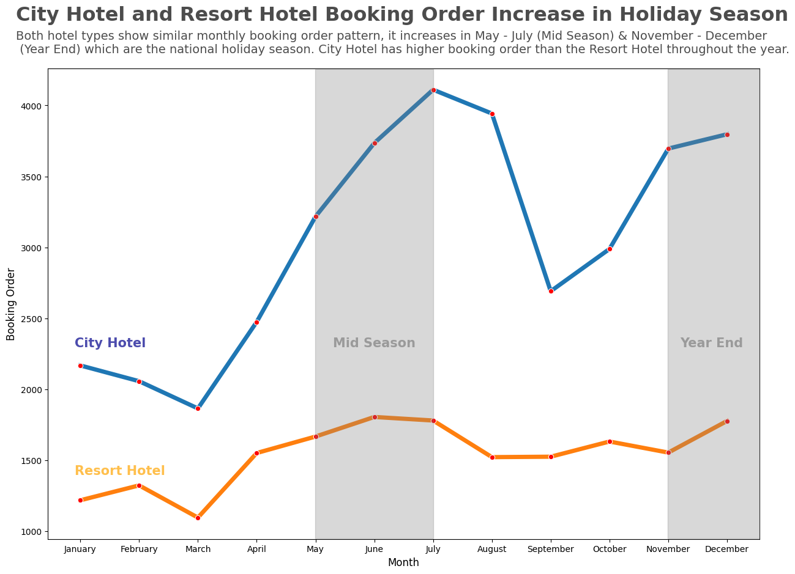
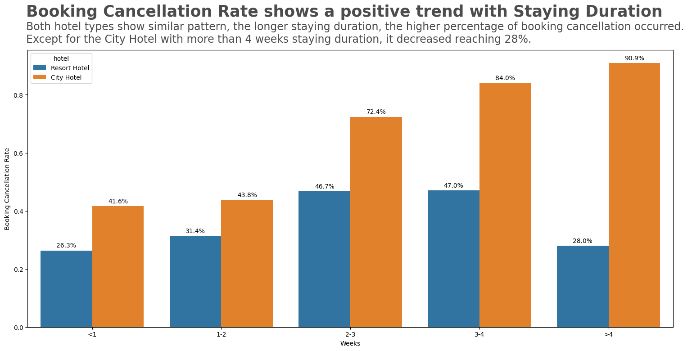

# Investigate Hotel Business using Data Visualization

Dataset : Provided by Rakamin Academy 
 
Tools : Jupyter Notebook 
 
Programming Language : Python
 
 

## Project Background
Business Performance Analysis is fundamental to understand the business current condition. It is performed to identify the advantages and disadvantages of the company and putting it into consideration in order to handle it. In hotel business, it is used to indetify customer behaviours. One way to perform it is using Data Visualization from historical data to gather insights that might be useful for the business team. These insights is gathered by doing Exploratory Data Analysis and visualize them into graphs and figures to make it easier to understand them. In this project, the focus will be in analyzing the key factors of booking cancellation of customer.   

## Data Pre-Processing
The dataset is consisted of 29 columns & 119390 rows. It is hotel business data from 2017-2019.

Table 1. Data Pre-Processing Treatment  
**No**  |     **Treatment**      |    **Findings**     |    **Actions**     |
:-----: |    ----------------    |    ------------     |--------------------|
1 |   Handling Missing Values    |    Null Values are identified in few features :   1. `company` (112.593 rows)   2. `agent` (16.340 rows)   3. `city` (488 rows)   4. `children` (4 rows)    |- Replacing Null with 0 in `company`, `agent`,  `children`,   - Replacing Null with _Undefined_ in `city`|
2 |   Replacing Irrelevant Values     |    _Undefined_ values are identified in `meal`, `market_segment`, `distribution_channel`|- Replacing _Undefined_ in `meal` with _No Meal_,   - Replacing with the mode values from each features in `market_segment`, `distribution_channel` |
3 |    Dropping Unnecesary Values    |    There are 180 rows of booking data with 0 guest (`adult` + `children` + `babies` = 0)|Dropping the rows with 0 guest|

## Data Analysis
### Monthly Hotel Booking Analysis Based on Hotel Type
This analysis is performed to understand the booking pattern based on hotel type. The increase of booking will also increase potential income for the company. Thus, it is very important to understand the pattern.

 Fig 1. Monthly Booking Order 

Fig 1. shows that both hotel have a similar pattern, which increase in National Holiday Season (Mid Season & Year End). Mid Season is in May-July when the student at school and college is having semester break and also Ramadhan month for the Moslem. Meanwhile, Year End is in November-December which are Christmas and New Year holiday to gather with the family. Both hotel lowest month is in March. Throughout the year, City Hotel has a much bigger booking than Resort Hotel. Conversely, February & March is the lowest month where the number of holiday is less than other months.
 
 

### Impact Analysis of Stay Duration on Hotel Bookings Cancellation Rate

    
Fig 2. City Hotel Bookings Cancellation Ratio

Fig 2 describes the city hotel booking cancellation ratio. 

  

 Fig 3. Resort Hotel Bookings Cancellation Ratio 

 Fig 4. Staying Duration Impact to Booking Cancellation Rate 

